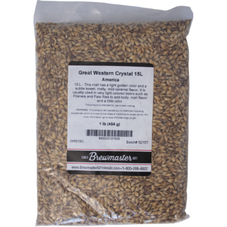
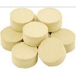

# Columbus IPA

* **Date brewed:** XX, 2022
* **Brew team:** Kenny (team lead), Joe, Adam, Mike M., Ally  

## Recipe Kit

[Product page](https://www.morebeer.com/products/columbus-ipa-extract-beer-brewing-kit-5-gallons.html)

[PDF](../columbus-ipa.pdf)

## Ingredients

### Water 

6 gallons of distilled water

### Steeping Grains

#### 1.5 lbs. Crystal 15L

*1-lb. bag shown*

[Product page](https://www.morebeer.com/products/great-western-crystal-15l-malt.html)

### Malt Extract

#### 9 lbs. Ultralight Malt Extract (LME)

[Product page](https://www.morebeer.com/products/ultralight-malt-extract-lme.html)

### Hops

#### 1 oz. Columbus (Pellets)

[Product page](https://www.morebeer.com/products/columbus-hops-pellets.html)

#### 2 oz. Columbus (Pellets)

[Product page](https://www.morebeer.com/products/columbus-hops-pellets.html)

#### 2 oz. Columbus (Pellets)

[Product page](https://www.morebeer.com/products/columbus-hops-pellets.html)

### Clarifier

#### 1 Whirfloc Tablet

[Product page](https://www.morebeer.com/products/whirlfloc-tablets.html)

### Yeast

#### Safale US-05 American Ale (Dry) Yeast - Fermentis

[Product page](https://www.morebeer.com/products/safale-us05-american-ale-yeast-fermentis.html)

#### Propper Starter Condensed Wort 16 oz Can

[Product page](https://omegayeast.com/propper/propper-starter)