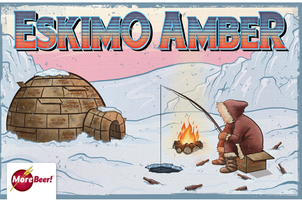

# Eskimo Amber Ale

* **Date brewed:** Sunday, February 20, 2022 (yeast starter night before)
* **Brew team:** Kenny (team lead), Michael, Adam, Anthony, Ally
* **Original gravity:** 1.058
* **Days in fermenter:** 14
* **Fermentation temperature:** 64-66°
* **Final gravity:** 1.016
* **ABV:** 5.5%
* **Appearance:** 15 SRM (Dark Amber) 

## Recipe Kit

[Product page](https://www.morebeer.com/products/alaskan-amber-clone-eskimo-ale-extract.html)

[PDF](../eskimo-amber-ale.pdf)

## Ingredients

### Yeast Starter

#### Wort

[Propper Starter Condensed Wort 16 oz Can](https://omegayeast.com/propper/propper-starter)

#### Yeast

[WLP029 German Kolsch - White Labs (Liquid) Yeast](https://www.morebeer.com/products/wlp029-german-kolsch-white-labs-yeast.html)

### Water 

6 gallons of distilled water

### Steeping Grains

* [1 lbs. Crystal 60L](https://www.morebeer.com/products/briess-caramel-60l-malt.html)
* [6 oz. Crystal 40L](https://www.morebeer.com/products/briess-caramel-40l-malt.html)
* [4 oz. Crystal 120L](https://www.morebeer.com/products/briess-caramel-120l-malt.html)

### Malt Extract

[8 lbs. Ultralight Malt Extract (LME)](https://www.morebeer.com/products/ultralight-malt-extract-lme.html)

### Hops (Pellets)

* 60 minutes: [1 oz. Cascade Hops](https://www.morebeer.com/products/cascade-hops-pellets.html)
* 10 minutes: [1 oz. Czech Saaz Hops](https://www.morebeer.com/products/czech-saaz-hops-pellets.html)

### Clarifier

[1 Whirfloc Tablet](https://www.morebeer.com/products/whirlfloc-tablets.html)
