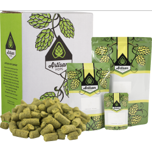

# German Hefeweizen

* **Date brewed:** September 10, 2022
* **Brew team:** Kenny (team lead), Joe  

## Recipe Kit

[Product page](https://www.morebeer.com/products/german-hefeweizen-extract-beer-brewing-kit-5-gallons.html)

[PDF](../german-hefeweizen.pdf)

## Ingredients

### Water 

6 gallons of distilled water

### Malt Extract

#### 6 lbs. Bavarian Wheat (DME)

[Product page](https://www.morebeer.com/products/wheat-dry-malt-extract-dme.html)

### Hops

#### .5 oz Northern Brewer Hops (Pellets)

[Product page](https://www.morebeer.com/products/northern-brewer-hops-pellets.html)

### Yeast

#### WLP300 Hefeweizen - White Labs Yeast

[Product page](https://www.morebeer.com/products/wlp300-hefeweizen-white-labs-yeast.html)

*Bavarian Wheat DME used for yeast starter.*