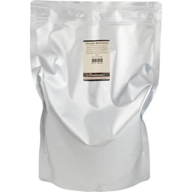
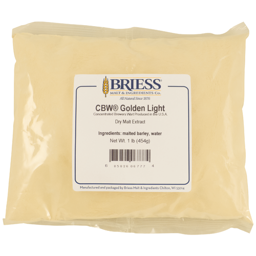
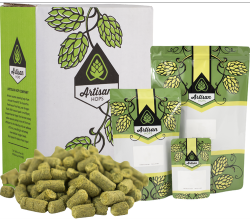

# Hop Blonde Ale

* **Date brewed:** XX XX, 2022
* **Brew team:** Kenny (team lead), Joe, Ally

## Recipe Kit

[Product page](https://www.morebeer.com/products/hop-blonde-extract-beer-brewing-kit-5-gallons.html)

[PDF](../hop-blonde-ale.pdf)

## Ingredients

### Water 

6 gallons of distilled water

### Steeping Grains

#### 1 lb. Crystal 10L

[Product page](https://www.morebeer.com/products/briess-caramel-10l-malt.html)

#### 1 lb. White Wheat

[Product page](https://www.morebeer.com/products/malt-briess-white-wheat-lb-showroom.html)

### Malt Extract

#### 6 lbs. Ultralight Malt Extract (LME)

[Product page](https://www.morebeer.com/products/ultralight-malt-extract-lme.html)

#### 0.5 lb. Light DME

[Product page](https://www.morebeer.com/products/golden-dry-malt-extract-dme.html)

### Hops

#### 1. oz Magnum Bittering Hops (Pellets)

[Product page](https://www.morebeer.com/products/magnum-hops-pellets.html)

#### 1 oz. Cascade Hops (Pellets)

[Product page](https://www.morebeer.com/products/cascade-hops-pellets.html)

#### 1 oz. Willamette Hops (Pellets)

[Product page](https://www.morebeer.com/products/willamette-hops-pellets.html)

#### 1 oz. Simcoe Hops (Pellets)

[Product page](https://www.morebeer.com/products/simcoe-hops-pellets.html)

### Clarifier

#### 1 Whirfloc Tablet

[Product page](https://www.morebeer.com/products/whirlfloc-tablets.html)

### Yeast

#### CellarScience® CALI Dry Yeast

[Product page](https://www.morebeer.com/products/cellarscience-cali-dry-yeast.html)

#### Propper Starter Condensed Wort 16 oz Can

[Product page](https://omegayeast.com/propper/propper-starter)