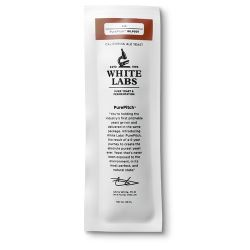

# Anchorage Amber Ale

* **Date brewed:** April 29, 2023
* **Brew team:** Kenny (team lead), Adam, Anthony, Mike M., Ally

## Recipe Kit

[Product page](https://www.morebeer.com/products/alaskan-amber-clone-eskimo-ale-extract.html)

[PDF](../eskimo-amber-ale.pdf)

## Ingredients

### Water 

6 gallons of distilled water

### Steeping Grains

#### 1 lbs. Crystal 60L

*1-lb. bag shown*

[Product page](https://www.morebeer.com/products/briess-caramel-60l-malt.html)

#### 6 oz. Crystal 40L

*1-lb. bag shown*

[Product page](https://www.morebeer.com/products/briess-caramel-40l-malt.html)

#### 4 oz. Crystal 120L

*1-lb. bag shown*

[Product page](https://www.morebeer.com/products/briess-caramel-120l-malt.html)

### Malt Extract

#### 8 lbs. Ultralight Malt Extract (LME)

[Product page](https://www.morebeer.com/products/ultralight-malt-extract-lme.html)

### Hops

#### 1 oz. Cascade Hops (Pellets)

[Product page](https://www.morebeer.com/products/cascade-hops-pellets.html)

#### 1 oz. Czech Saaz Hops (Pellets)

[Product page](https://www.morebeer.com/products/czech-saaz-hops-pellets.html)

### Clarifier

#### 1 Whirfloc Tablet

[Product page](https://www.morebeer.com/products/whirlfloc-tablets.html)

### Yeast

#### WLP029 German Kolsch - White Labs (Liquid) Yeast

[Product page](https://www.morebeer.com/products/wlp029-german-kolsch-white-labs-yeast.html)

#### Propper Starter Condensed Wort 16 oz Can

[Product page](https://omegayeast.com/propper/propper-starter)