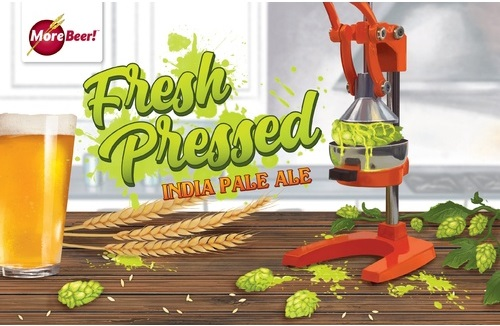

# Fresh Pressed IPA

* **Date brewed:** Sunday, February 19, 2023 (yeast starter night before)
* **Brew team:** Kenny (team lead), Adam, Anthony, Mike M.
* **Original gravity:** 1.063
* **Days in fermenter:** 14
* **Fermentation temperature:** 64-68°
* **Final gravity:** 1.015
* **ABV:** 6.3%
* **Appearance:** 8 SRM (Pale Amber) 

## Recipe Kit

[Product page](https://www.morebeer.com/products/fresh-squeezed-ipa-clone-pressed-extract.html)

[PDF](../fresh-pressed-ipa.pdf)

## Ingredients

### Yeast Starter

#### Wort

[Bavarian Wheat DME](https://www.morebeer.com/products/wheat-dry-malt-extract-dme.html) (how much?)

#### Yeast

[CellarScience® CALI Dry Yeast](https://www.morebeer.com/products/cellarscience-cali-dry-yeast.html)

### Water 

6 gallons of distilled water

### Steeping Grains

* 2 lbs. Munich (not sure which one)
* [12 oz. Crystal 75L](https://www.morebeer.com/products/great-western-crystal-75l-malt.html)

### Malt Extract

[9 lbs. Pale Liquid Extract (LME)](https://www.morebeer.com/products/pale-malt-extract-lme.html)

### Hops (Pellets)

* 60 minutes: [.5 oz. Nugget](https://www.morebeer.com/products/nugget-hops-pellets.html)
* 15 minutes: [1 oz. Citra](https://www.morebeer.com/products/citra-hops-pellets.html)
* 15 minutes: [1 oz. Mosaic](https://www.morebeer.com/products/mosaic-hops-pellets.html)
* Flameout: [1 oz. Citra](https://www.morebeer.com/products/citra-hops-pellets.html)
* Day 9 (dry-hopping): [1 oz. Citra](https://www.morebeer.com/products/citra-hops-pellets.html)
* Day 9 (dry-hopping): [1 oz. Mosaic](https://www.morebeer.com/products/mosaic-hops-pellets.html)

### Clarifier

(not sure which one)

