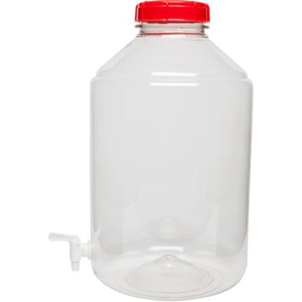
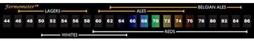

# Equipment

This page documents all of my brewing equipment.

## DigiBoil Electric Kettle - 35L/9.25G (110V)

[Product page](https://www.morebeer.com/products/digiboil-electric-kettle-35l925g-110v.html)

### Neoprene Jacket for BrewZilla 3.1.1 & DigiBoil - 35L

[Product page](https://www.morebeer.com/products/robojacket-neoprene-jacket-35l-robobrew-brewzilla.html)

## Immersion Wort Chiller - 25 ft. x 3/8 in.

[Product page](https://www.morebeer.com/products/immersion-wort-chiller-25-ft-38.html)

### Sink Faucet Adapter - Stainless

[Product page](https://www.morebeer.com/products/sink-faucet-adapter-stainless.html)

## Stainless Steel Brewing Spoon - 21 in.

[Product page](https://www.morebeer.com/products/stainless-steel-brewing-spoon-21.html)

## Thermometer

Not sure which one.

## Airlock - 3 Piece

[Product page](https://www.morebeer.com/products/airlock-3-piece.html)

## Rubber Stopper - #10 With Hole

I *think* this is the right one...:

[Product page](https://www.morebeer.com/products/rubber-stopper-10-hole-1.html)

## Fermonster Carboy - 6 gal. With Spigot

[Product page](https://www.morebeer.com/products/fermonster-carboy-6-gal-spigot.html)

### Fermometer - Adhesive Thermometer

[Product page](https://www.morebeer.com/products/fermometer-adhesive-thermometer.html)

## Triple Scale Hydrometer

[Product page](https://www.morebeer.com/products/triple-scale-hydrometer.html)

### Hydrometer Jar - 14 in.

[Product page](https://www.morebeer.com/products/hydrometer-jar-14.html)

## Plastic Fermenting Bucket - 6 gal. (With Spigot)

[Product page](https://www.morebeer.com/products/plastic-bucket-6-gal-spigot.html)

## High Temp Silicone Tubing - 3/8 in.

[Product page](https://www.morebeer.com/products/tubing-silicone-38-id.html)
