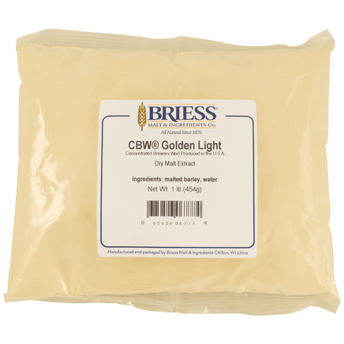

# Malt Extract

* Ultralight LME (American Pale Ale II, Eskimo/Anchorage Amber Ale, Columbus IPA, Hop Blonde Ale, Ugly Fish IPA)
* Pale LME (Fresh Pressed IPA)
* Light DME (Hop Blonde Ale)
* Bavarian Wheat DME (German Hefeweien)

## Liquid Malt Extract (LME)

### Ultralight Malt Extract (LME)

[Product page](https://www.morebeer.com/products/ultralight-malt-extract-lme.html)

## Dry Malt Extract (DME)

### CBW Bavarian Wheat (DME)

[Product page](https://www.morebeer.com/products/wheat-dry-malt-extract-dme.html)

### CBW Golden Light (DME)

[Product page](https://www.morebeer.com/products/golden-dry-malt-extract-dme.html)